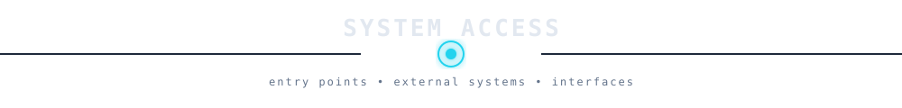
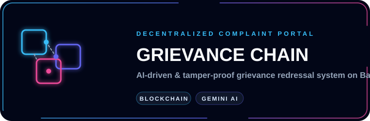
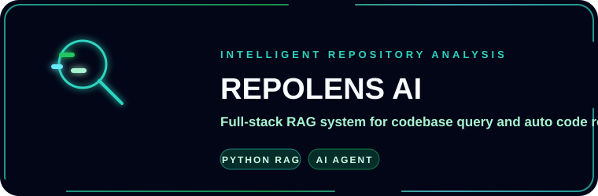
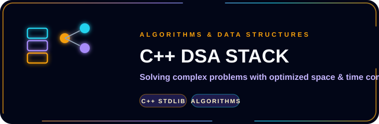
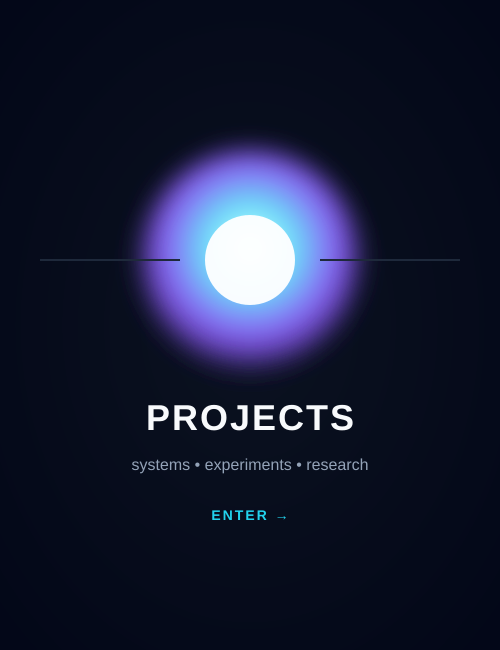

  

<!-- Title -->
<h3 align="center">
     <samp>
        &gt; Hey There!, I am
        <b><a target="_blank" href="https://www.linkedin.com/in/alok-yadav-0b7628309/">Alok Yadav</a></b>
     </samp>
</h3>

 

<samp>
「 Full Stack Developer building decentralized applications, AI-driven platforms, and robust C++ systems 」  
</samp>

  

<!-- Title -->

  

  

# 🛠 Technologies and Projects

<table border="0" cellspacing="10" cellpadding="0" align="center">
<tr>

<!-- LEFT: TOOLS -->
<td width="560" valign="top" align="center">

<h3>🛠 Technologies</h3>
 

<table align="center" cellspacing="0" cellpadding="6">
  <tr>
    <td align="center"></td>
    <td align="center"></td>
    <td align="center"></td>
    <td align="center"></td>
    <td align="center"></td>
  </tr>
  <tr>
    <td align="center"></td>
    <td align="center"></td>
    <td align="center"></td>
    <td align="center"></td>
    <td align="center"></td>
  </tr>
  <tr>
    <td align="center"></td>
    <td align="center"></td>
    <td align="center"></td>
    <td align="center"></td>
    <td align="center"></td>
  </tr>
  <tr>
    <td align="center"></td>
    <td align="center"></td>
    <td align="center"></td>
    <td align="center"></td>
    <td align="center"></td>
  </tr>
</table>

</td>

<!-- PROJECTS -->
<td width="360" valign="top" align="center">

<h3>🧪 Projects</h3>
 

  

</td>

</tr>
</table>

### 📊 Vital Statistics

  

  

    

  

<h2 align="center">📫 Contact &amp; Connect</h2>
 

&nbsp;&nbsp;

&nbsp;&nbsp;

⚡ Building modern full-stack web applications, decentralized platforms, and optimized algorithms

Star ⭐ the repos if they helped you!

  <a href="./CODE_OF_CONDUCT.md">Code of Conduct</a> ·
  <a href="./SECURITY.md">Security</a>

    

  

