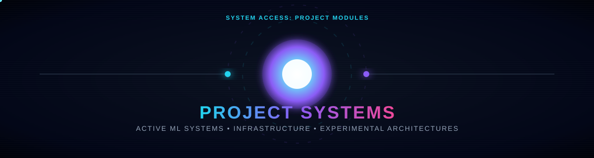
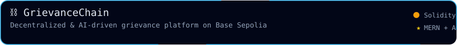
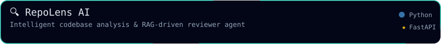
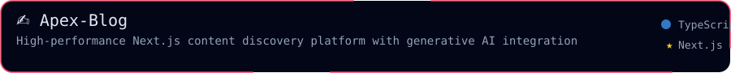
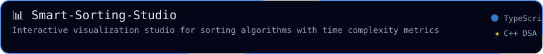
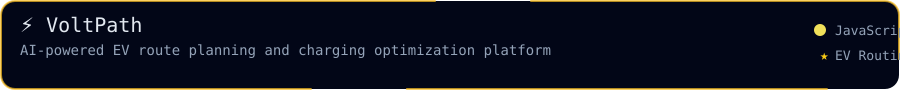

  

  
  
  
  

---

  <b>Selected work across decentralized platforms, smart contracts, C++ DSA, and full stack web systems.</b>

  This page highlights projects that match my background: building practical full stack systems, blockchain smart contracts on Base Sepolia, RAG-driven AI agents, and optimized algorithmic solutions in C++.

<h2 align="center">🧪 Project Highlights</h2>

<!-- Row 1 -->

  
  

<!-- Row 2 -->

  
  

<!-- Row 3 -->

  

## Project Index

| Project | Focus | Status | Why it matters |
| --- | --- | --- | --- |
| [GrievanceChain](https://github.com/alokyadva26/GrievanceChain) | Base Sepolia, React, Express, Gemini AI, ethers.js | Hackathon | Immutable, decentralized grievance platform ensuring transparency, Corruption Score Index, and SLA auto-escalation. |
| [repoLens-ai](https://github.com/alokyadva26/repoLens-ai) | FastAPI, Python, React, FAISS, RAG, AI Agent | Showcase | RAG-driven AI platform providing automated codebase reviews and answering complex architecture queries. |
| [Apex-Blog](https://github.com/alokyadva26/Apex-Blog) | Next.js, React, TypeScript, Generative AI, MERN | Showcase | High-performance, full-stack content discovery platform demonstrating seamless generative AI integration within secure web architecture. |
| [Smart-Sorting-Studio](https://github.com/alokyadva26/Smart-Sorting-Studio) | React, TypeScript, Algorithms, CSS Animations | Showcase | Modern web application visualizing and comparing sorting algorithms with stunning UI and real-time complexity metrics. |
| [VoltPath](https://github.com/alokyadva26/VoltPath) | Full Stack, JavaScript, EV Routing, Optimization | Showcase | AI-powered EV route planning and charging optimization platform simplifying green transit. |

---

<h2 align="center">📊 Activity</h2>

  

  

  
    

